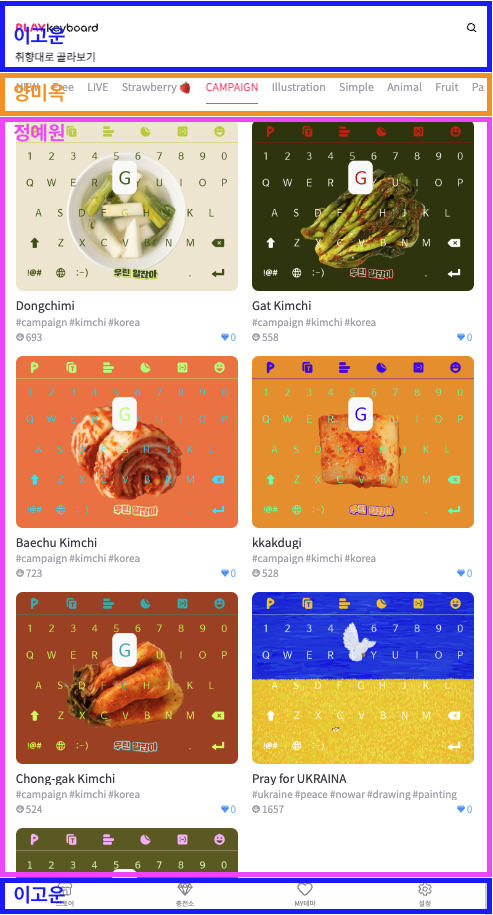
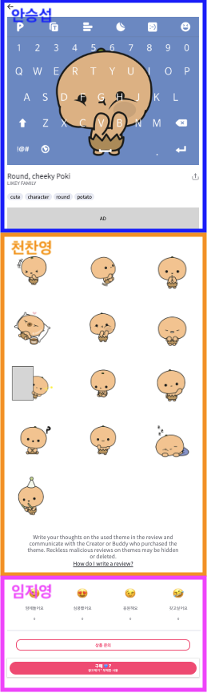

# play-keyboard-react-bitbyte

> 비트바이트 모바일 반응형 플레이 키보드 웹 스토어 프로젝트입니다.

## 🚀 개발 기간

**2022.10.04 - 2022.10.06**

## 🚀 팀원 및 역할

<b>페이지1 담당</b>

 

 

- 이고운 : 헤더 및 푸터 구현
- 양미옥 : 카테고리바 구현
- 정예원 : 테마 카드 리스트 구현

<b>페이지2 담당</b>

 

 

- 안승섭 : 프로젝트 초기 세팅, 이모티콘 상세 정보, 키보드 구현
- 천찬영 : 이모티콘 리스트 구현
- 임지영 : 리뷰 및 버튼 구현

## 🚀 적용 기술

<b>언어</b>

 

- Javascript
- React js

<b>라이브러리</b>

 

- sass
- styled-components
- styled-reset
- react-icons
- react-router-dom
- react-modal-sheet
- framer-motion
- react-simple-keyboard
- mole-virtual-keyboard

## 🚀 협업 방식

<b>협업 툴</b>

 

- zep
- slack
- [notion](https://wecode.notion.site/4-625b7c21d7b949e98c49ee947c470266)

<b>코드 컨벤션</b>

 

1. 버전: Node.js 16.16.0
2. Styled-Components, SCSS 혼합해서 사용
3. 클래스명은 언더바 형식으로 통일
4. fetch를 이용한 API 통신
5. 파일 확장자는 모두 js로 통일
6. 에셋은 src/Assets 하위에 배치
7. Git-flow

> 💡 반응형의 경우 [Screen Sizes](https://screensiz.es/) 사이트를 참고하여 최소 태블릿 가로 사이즈인 600을 기준으로 잡았습니다. 가로 사이즈가 600 미만인 경우 모두 모바일이라 판단하였고, 600 이상인 경우 태블릿이라 판단하여 전체적인 크기를 키울 수 있도록 작업했습니다.

## 🚀 구현 화면

<b>Demo</b>

 

[배포주소](https://maketheworldwise.github.io/play-keyboard-react-bitbyte/)

